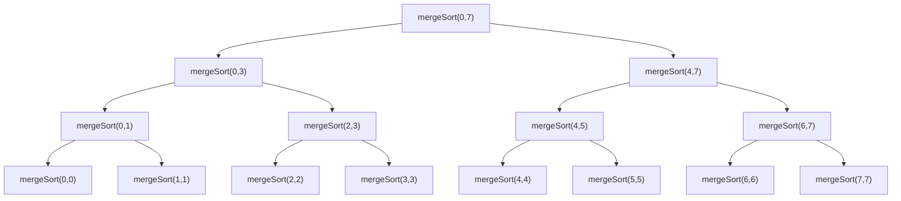

Merge sort is one of the most widely used sorting algorithms in practice. Several
language standard libraries build their default sort on it (or on a hybrid that
includes it), because it is **fast**, **stable**, and has **predictable
performance** on every input.

The idea is small: keep splitting the array in half until every piece has one
element, then repeatedly *merge* pairs of sorted pieces back together. A merge of
two sorted lists is easy, and once the whole tree has been merged the array is
sorted.

## Divide and conquer

Merge sort is the textbook example of **divide and conquer**:

1. **Divide** — split the array into two halves.
2. **Conquer** — sort each half recursively.
3. **Combine** — merge the two sorted halves into one sorted array.

Because each call spawns *two* recursive calls, this is **two-branch recursion**
(also called binary recursion), the same shape as a naive Fibonacci.

## Splitting: indices and the base case

Rather than physically slicing the array on every call (which wastes memory), we
pass the original array plus two indices, `s` and `e`, that mark the sub-array
`arr[s..e]` we are responsible for.

**Finding the midpoint.** Use floor division:

```python
m = (s + e) // 2
```

The left half is `arr[s..m]` and the right half is `arr[m+1..e]`.

**The base case.** The length of the current sub-array is `e - s + 1`. We stop
recursing once that length is `0` or `1`:

```python
if e - s + 1 <= 1:
    return arr
```

A sub-array of one element has `s == e`, so `e - s + 1 == 1`. A sub-array of that
size is already sorted, so we just return.

**Height of the recursion.** Each level halves the sub-array size, so it takes
about $\log_2 N$ splits to go from $N$ elements down to $1$. The recursion tree
has height $\lceil \log_2 N \rceil$, and any root-to-leaf path passes through
$1 + \lceil \log_2 N \rceil$ nodes.

## The `mergeSort` function

```python
def mergeSort(arr, s, e):
    # Base case: 0 or 1 elements is already sorted
    if e - s + 1 <= 1:
        return arr

    # Midpoint of arr[s..e]
    m = (s + e) // 2

    # Sort the left half  arr[s..m]
    mergeSort(arr, s, m)

    # Sort the right half arr[m+1..e]
    mergeSort(arr, m + 1, e)

    # Merge the two now-sorted halves back into arr[s..e]
    merge(arr, s, m, e)

    return arr
```

`mergeSort` sorts the segment in place and returns `arr` only for convenience.

## The `merge` step

`merge` takes a segment `arr[s..e]` whose two halves `arr[s..m]` and `arr[m+1..e]`
are *each already sorted*, and rearranges the segment so the whole thing is
sorted.

It is a classic **two-pointer** walk. Copy the two halves into scratch arrays `L`
and `R`, then advance three indices:

- **`i`** — the current element of `L` (the left half) being compared.
- **`j`** — the current element of `R` (the right half) being compared.
- **`k`** — where the next element goes in `arr`.

At each step we compare `L[i]` and `R[j]`, copy the smaller one into `arr[k]`, and
advance the pointer we took it from. `k` advances every step, because every step
places exactly one element. When one half runs out, we copy whatever remains of
the other half.

```python
def merge(arr, s, m, e):
    # Copy the two sorted halves into scratch arrays
    L = arr[s:m + 1]
    R = arr[m + 1:e + 1]

    i = 0   # index into L
    j = 0   # index into R
    k = s   # write index into arr

    # Merge back into arr[s..e] until one half is exhausted
    while i < len(L) and j < len(R):
        if L[i] <= R[j]:      # `<=` (not `<`) is what makes the sort stable
            arr[k] = L[i]
            i += 1
        else:
            arr[k] = R[j]
            j += 1
        k += 1

    # Exactly one of these loops runs, draining the leftover half
    while i < len(L):
        arr[k] = L[i]
        i += 1
        k += 1
    while j < len(R):
        arr[k] = R[j]
        j += 1
        k += 1
```

Note that despite writing back into `arr`, this is **not an in-place merge**: `L`
and `R` are full copies of the halves.

## A worked example

Sorting an array of $N = 8$ (indices `0..7`), the calls fan out like this:



Reading the leftmost path: `mergeSort(0,7)` splits at `m = (0+7)//2 = 3` and calls
`mergeSort(0,3)`, which splits at `m = 1` and calls `mergeSort(0,1)`, which splits
at `m = 0` and calls `mergeSort(0,0)` — a base case. Its sibling `mergeSort(1,1)`
is also a base case, and then `merge(0, 0, 1)` combines the two single elements
into a sorted pair. Control unwinds back up the tree, merging larger and larger
runs, until `merge(0, 3, 7)` produces the fully sorted array.

## Time complexity

Let $T(N)$ be the cost of sorting $N$ elements:

$$
T(N) = \underbrace{2\,T(N/2)}_{\text{two halves}} + \underbrace{\Theta(N)}_{\text{merge}}
$$

Each `merge` of a segment of length $N$ does $\Theta(N)$ work — it copies and
then writes back every element. There are $\log_2 N$ levels of recursion, and the
merges on each level touch $\Theta(N)$ elements in total, giving:

$$
T(N) = \Theta(N \log N)
$$

The split is always down the middle and the merge always scans everything, so the
input's initial order does not matter:

| Case | Time |
| --- | --- |
| Best | $\Theta(N \log N)$ |
| Average | $\Theta(N \log N)$ |
| Worst | $\Theta(N \log N)$ |

This is the key advantage over quicksort (which degrades to $\Theta(N^2)$ on bad
pivots) and over $\Theta(N^2)$ algorithms like insertion sort on large inputs.

## Space complexity

Merge sort needs extra memory, from two sources.

**Scratch arrays on the heap.** Every `merge` allocates `L` and `R`. The
recursion is depth-first, and a node's `merge` runs *only after both of its
children have fully returned* — at which point those children's scratch arrays
have already been freed. So at any instant only one `merge` is live. The largest
one, at the root, copies the entire array: $O(N)$.

**The call stack.** The deepest chain of active frames is one root-to-leaf path,
$1 + \lceil \log_2 N \rceil$ frames. Each frame holds only a few integer indices
and a reference to the shared array, i.e. $O(1)$. Stack cost: $O(\log N)$.

**Total.**

$$
O(N) + O(\log N) = O(N)
$$

The $O(N)$ term dominates, so **merge sort uses $O(N)$ auxiliary space**. (The
array version above is therefore not in-place. In-place merge variants exist but
are slower or more complex, which is why the standard implementation copies.)

## Stability

Merge sort is a **stable** sort — equal elements keep their original relative
order — as long as the merge breaks ties in favor of the left half:

```python
if L[i] <= R[j]:      # take from the left on equality
    arr[k] = L[i]
    i += 1
```

Consider two equal keys, one in the left half and one in the right. Since the
left half holds elements that came *earlier* in the original array, and `<=`
sends the left one into `arr` first, their original order survives the merge. If
you wrote `<` instead, the right element would go first and stability would be
lost.

## Summary

| Property | Merge sort |
| --- | --- |
| Time (best / avg / worst) | $\Theta(N \log N)$ / $\Theta(N \log N)$ / $\Theta(N \log N)$ |
| Auxiliary space | $O(N)$ |
| Stable | Yes (with `<=` in the merge) |
| In-place | No (standard array implementation) |
| Paradigm | Divide and conquer, two-branch recursion |

## References

- NeetCode — *DSA for Beginners*, lesson 11: <https://neetcode.io/courses/dsa-for-beginners/11>
- Merge walkthrough video: <https://youtu.be/RXbe0JWUKao>
